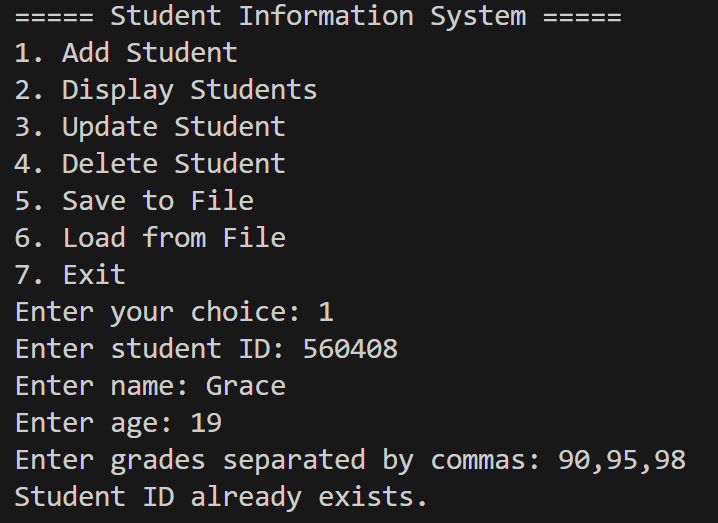
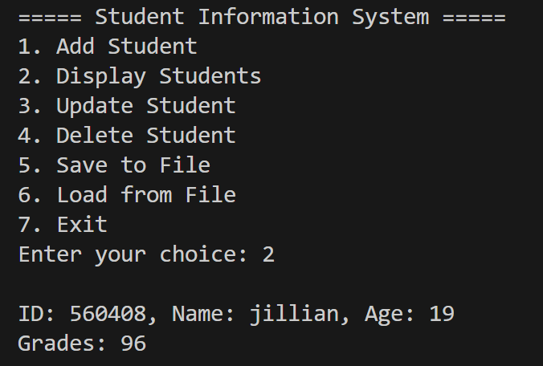
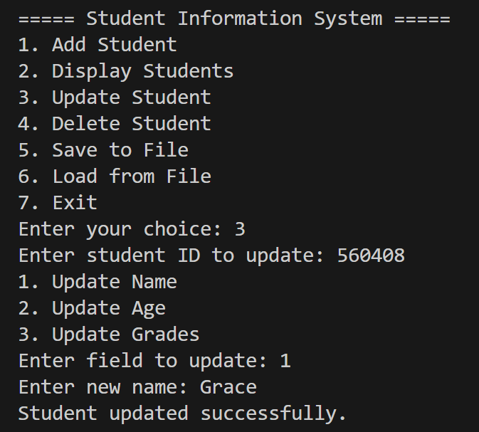
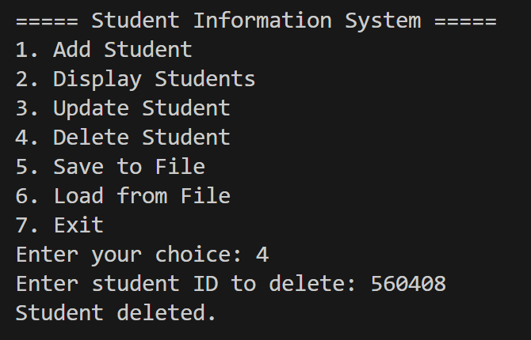
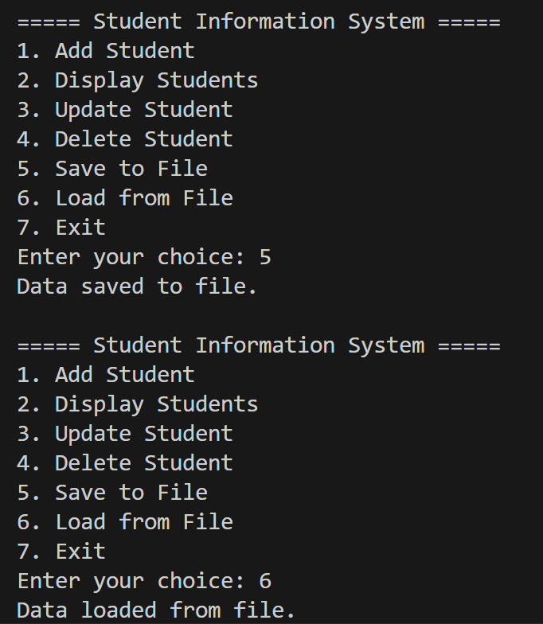
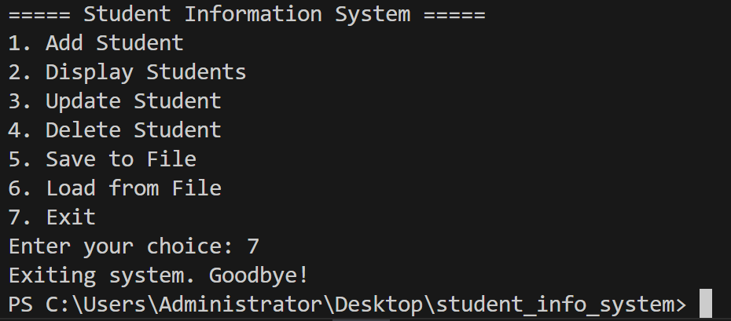

# 🧑‍🎓 Student Information System (Python Project)

This Python program manages student records with options to add, update, delete, and view student data. It also uses CSV file handling to persist data.

## Features
- Add students (ID, name, age, grades)
- Update student info
- Delete student
- Display all students (with nested loops)
- Save and load data using `.csv` file
- Uses:
  - Loops (`while`, `for`, `break`, `continue`)
  - Data structures: Lists, Tuples, Dictionaries
  - File handling
  - Functions and lambda
  - Variable scope and argument types

## How to Run

```bash
python student_system.py


## Sreenshots
Here are the screenshots of the system:








✍️ Author: JILLIAN GRACE C. NACASABUG


